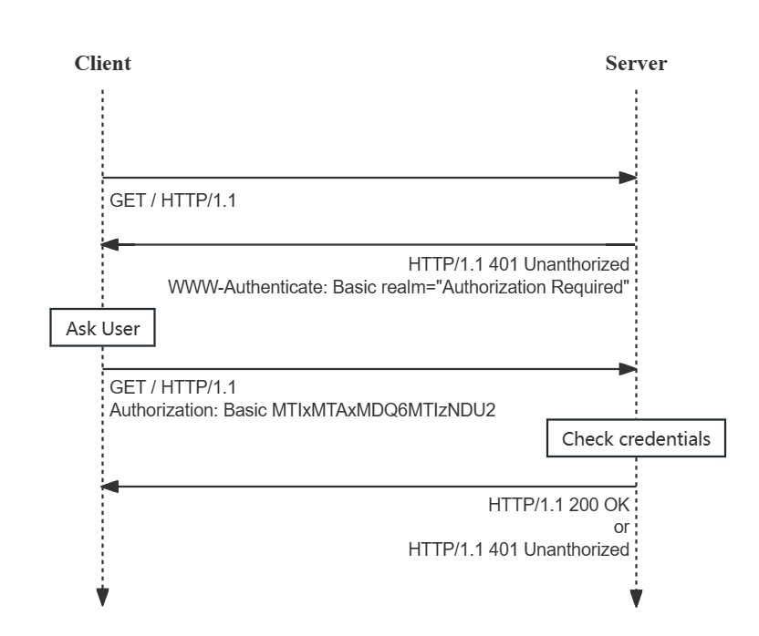
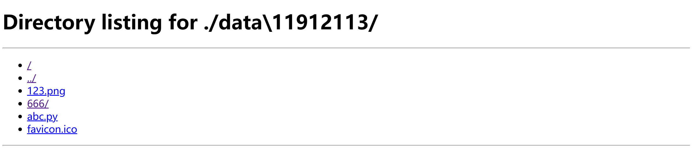
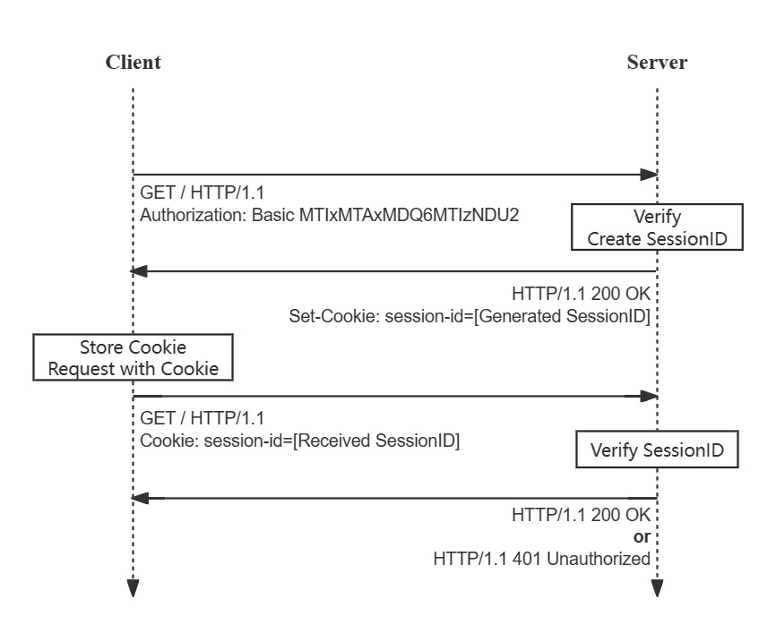

# CS305 Computer Networks Project: HTTP File Manager

**Semester: 2023 Fall**

**Last Update: 2023/11/14**

**Submit deadline: 2023/12/31 23:59:59**


## Introduction

**Hypertext Transfer Protocol** (HTTP) is an application-layer protocol using transmission control protocol (TCP) designed for transmitting hypermedia data between web servers and browser. HTTP works as a request-response protocol between a client and server, the client first submits an HTTP request to the server, and the server should return a response to the client. HTTP/1.1 is designed as an enhancement of HTTP/1.0, with extensions of persistent connections,request methods, status codes and efficient header compression. The standard of HTTP/1.1 is defined in [RFC 2616: HTTP/1.1](https://www.rfc-editor.org/rfc/rfc2616). For the later HTTP versions, HTTP/2 supports multiplexing and server push, then HTTP/3 uses Quick UDP Internet Connections (QUIC), a transport layer protocol developed by Google that uses UDP instead of TCP. You can learn HTTP further in [HTTP|MDN Web Docs](https://developer.mozilla.org/en-US/docs/Web/HTTP).

### Requirements

In this project, you are required to construct a simple file manager server in **Python** based on characteristics of HTTP/1.1 that has ability to serve several clients with legitimate permissions to view, download, upload, delete files, etc. You should construct your own HTTP server framework using [Socket]([socket — Low-level networking interface — Python 3.12.0 documentation](https://docs.python.org/3/library/socket.html)) API, **implement required service functions** and **map the HTTP requests to the corresponding functions** on server correctly. Socket is an abstraction of the transport layer, it provides inter-process communication (IPC) by establishing named contact points between which the communication takes place. Basically you should implement the HTTP server based on **TCP** socket.

For each part of the HTTP server, **the service API of the corresponding functions have been specified**. Your program should properly handle the requests from clients with valid response (status code, reason, headers and response body), return the status/error code correctly when client submits an invalid request or when exceptions occur, and **cannot cause a crash when your server is running**.

Since we will test your code only through the specified service API, there is **no framework code** provided in this project, so you need to construct your own HTTP service framework using `socket` API. In this project, you can **only** use the python libraries including `{argparse socket mimetypes io sys time datetime os signal threading pathlib traceback json}` **in the basic part** and other libraries for encoding or encryption (e.g. `uuid` or `base64`). If you want to use other python libraries, you can raise issues in **[Issues SUSTech-CS305-2023Fall](https://github.com/Leosang-lx/SUSTech-CS305-2023Fall/issues)** with title of the format `[Request for Python Lib] xxxxxxxx` and we will reply ASAP.

As for the code, you can refer to some reference code from the Internet or ChatGPT. Pay attention that any **plagiarism is intolerable**. If your project confirms plagiarism, you will get **0** points.

### **Test**

For the tasks described in the following sections, we will briefly explain the requirements for testing the listing functions, and your code will be tested through accessing the corresponding HTTP service API.

More explanations on specific testing scenarios and details will be provided in the **test document**, which will be released afterwards. While part of the tests will be released to provide you with an understanding of the task requirements and to check the basic logic of the code. You can also build some special test samples to demonstrate the performance of your server, and show the results in presentation of the last lab class. And we will perform the rest of tests check your implementation and functionality of your server. 

There should be a `server.py` in the root directory of your project. And we will start your server by running `python server.py -i localhost -p 8080` (for example), thus you should use `arparse` to support passing parameters in terminal. 

If you have questions, feel free to contact us, or raise questions in [Issues SUSTech-CS305-2023Fall](https://github.com/Leosang-lx/SUSTech-CS305-2023Fall/issues), which is more recommended.


## Basic Part (75%)

In the basic part, you are required to implement the **server side** of the HTTP file manager, and provide service APIs for clients to view a directory, download files, upload files and delete files. To begin your project, you should firstly build your HTTP service framework, so that your server can **accept and maintain the connections from clients**, **parse the received HTTP packets**, and **recognize users through authorization information**. Then for the task required in the following sections, your server should correctly provide corresponding response/service according to the request target from client.

You can get full marks of the basic part if your server can satisfy all requirements of the basic part and pass all test cases.


### 1. Basic HTTP Server (20%)

In this part, you should use `socket` API to construct your own HTTP server to receive and handle the HTTP requests from clients.

To handle a HTTP request, you should transfer the **binary data** received by Socket into a **HTTP request object** so that server can figure out the content of each part of HTTP request. Then for valid requests, your server should return the binary data of HTTP response to clients, which correspond to the **encapsulation** and **decapsulation** of HTTP request and response.

The **format and explanation of URL** can be found in the lab slides `lab3_http.pdf`, or refer to [What is a URL? (mozilla.org)](https://developer.mozilla.org/en-US/docs/Learn/Common_questions/Web_mechanics/What_is_a_URL).

An typical HTTP request and response have the following structure, and you should **strictly follow this format** when implementing your HTTP server.


#### Request Method

The request methods indicate different services that server provides to clients. The descriptions of request methods can be found in [RFC 2616: HTTP/1.1#Section-5.1.1](https://www.rfc-editor.org/rfc/rfc2616#section-5.1.1).

For simplification, your HTTP server only needs to support the following request methods:

- **GET**: The client requests specified resource, and server should response with the binary data of resource in response body.
- **HEAD**: Same as GET above except that the server will not include the binary data in body.
- **POST**: Submit data to server, with some potential side-effect


#### Headers

HTTP headers are set of key-value pairs to pass additional information of an HTTP request or response. A header has the format `{header_name}: {value}`, where `header-name` is **case-sensitive**.

The following are headers that you may need to use or handle in this project:

- Content-Type: the size of the message body, in bytes
- Content-Length: the original media type of the resource
- Connection: whether the network connection stays open after the current transaction finishes
- Set-Cookie / Cookie: addition information from server to client / client to server
- WWW-Authentication / Authorization: server requests authentication from client / client provides credentials for server
- Transfer-Encoding: the form of encoding used to safely transfer the payload body to user
- Range / Content-Range: specify content range (bytes in default) when request partial content

**The requirements and handling of specified headers for different scenarios will be detailed in the following sections.**


#### **Status Code and Reason Phrase**

The status code in response is a 3-digit integer to show the status and of the request. And the corresponding reason phrase is intended to give a short textual description of the status code, which is more comprehensible for human users. This two values are included in the status line of the HTTP response message. You can refer to [RFC 2616: HTTP/1.1#Section-6.1.1](https://www.rfc-editor.org/rfc/rfc2616#section-6.1.1) for introduction of the status code and reason phrase in the status line of response.

You can refer to [RFC 2616: HTTP/1.1#Section-10](https://www.rfc-editor.org/rfc/rfc2616#section-10) for complete types of status codes and reason phrases with definitions. The following are some status codes that you may need to support in this project:

- **2xx**: Success
  - **200** OK
  - **206** Partial Content
  
- **3xx**: Redirection
  - **301** Redirect

- **4xx**: Client Error
  - **400** Bad Request
  - **401** Unauthorized
  - **403** Forbidden
  - **404** Not Found
  - **405** Method Not Allowed
  - **416** Range Not Satisfiable
  
- **5xx**: Server Error
  - **502** Bad Gateway
  - **503** Service Temporarily Unavailable

**The requirements of status code for different scenarios will be detailed in the following sections.**


#### 1.1 Persistent Connection (10%)

In HTTP/1.0, only short connection is the default connection model. While in HTTP/1.1, new connection models including **persistent connection** and pipelining are introduced. 


In HTTP/1.1, any connection are persistent. The connection will maintain unless client or server actively close the connection, or receive a HTTP message with header `Connection: Close` and close the connection. The header `Connection`, introduced by [Connection - HTTP | MDN](https://developer.mozilla.org/en-US/docs/Web/HTTP/Headers/Connection), has the following values:

- `Connection: Close` implies that server or client wants to close the connection, which is the default value of request in HTTP/1.0
- `Connection: Keep-Alive` implies that the client wants to keep the connection on. While persistent connection is the default connection in request of HTTP/1.1

Each time when server receives a request from client, the server will build a TCP connection and try to **reuse** the connection to handle multiple requests **sequentially** from the same clients. The server **should not close the connection** unless the received request has a header `Connection: Close`.

**Task**: The server should handle the requests with persistent connection in default, with the ability to handle multiple requests sequentially in a single connection. And if the client sends request with `Connection: Close`, the server should close the current connection after finishing handling the request of received request.


#### 1.2 Support Many Clients (5%)

A server typically serves many clients, and may receive multiple requests at the same time. Therefore, your server should be able to handle multiple requests from different clients simultaneously. Besides, when some of the connections encounter exceptions, server should still **work well** to correctly handle other clients.

**Task**: The server should be able to accept and maintain multiple connections from clients and handle multiple requests from clients simultaneously.


#### 1.3 Authorization (5%)

In this part, you don't necessarily provide services for registering or changing password, you are only required to implement [**HTTP Basic Authorization Scheme**](https://developer.mozilla.org/en-US/docs/Web/HTTP/Authentication#the_general_http_authentication_framework) for user. And the authorization information of users includes username and password, which can be simply stored by server.



**Task**: When the first time a client access the server without authorization, the server will response with **401 Unauthorized** with `WWW-Authenticated: Basic realm="Authorization Required"` in header, asking user to provide authorization information.

- To provide authorization information, client should include authorization header `Authorization: Basic [EncodedInfo]` in HTTP request message, where **EncodedInfo** is encoded from string `{username}:{password}` using [Base64 encoding](https://developer.mozilla.org/en-US/docs/Glossary/Base64).
- If user provides invalid authorization information, server should response with **401 Unauthorized**.
- If user correctly provides the authorization information, server should response with status code **2xx**.
- **The services of the following part all require authorization**.


### 2. View and Download (25%)
In this part, you are required to implement a basic **directory viewer** and provide **file download service** with **authorization **for client. 

On the server side, all the files will be stored in the directory `/data` **under the root directory of your project**. Each time a client send a request with URL corresponding to a valid path in the server, the server will reply with a `html` page showing the files and directories of the current path or the content of the corresponding file according to path in the server.

**Task**: Implement a web **API for clients to view and download files**, so that a client can view the list of directory or download certain file by sending **GET** request to `http://localhost:8080/[access_path]`, where the `access_path` is the relative path under the `/data/` folder in the root directory of your project. The corresponding headers including `Content-Type` and `Content-Length` should be correctly derived by the file. You can refer to [Media Types (iana.org)](https://www.iana.org/assignments/media-types/media-types.xhtml) for more details of Media Types.

The following are examples that client sends a **valid** request to server, when server is running on `localhost:8080`. In these cases, server should provide users with specified services correctly and return **200 OK**.

You can refer to the **`html` template** by running `python -m http.server` on your computer and request to `http://localhost:[port]` on your browser.

- When a client wants to view the files under the directory `[project_root_dir]/data/11912113/`, it can directly send a HTTP request using **GET** method with URL `http://localhost:8080/11912113/` on your browser, then server will response with a `html` file showing file tree of the current directory as follows and return **200 OK**:where `/` and `../` refers to the root directory and above directory of the current. `123.png`, `abc.py`,`favicon.ico` are files and `666/` refers to a folder in the current directory.
- Then if you click `123.png` on above `html` page (with corresponding path `[project_root_dir/data/11912113/123.png]` on server) on the browser or send **GET** request to URL `http://localhost:8080/11912113/123.png`, the server will response with the binary content of the file `123.png` and return **200 OK**.

**Notice that** your server should also handle the **invalid requests** from clients. Following are some invalid cases: 

- If the format of the request URL or the query parameters are invalid, server should return **400 Bad Request**.
- If the request URL does not exist in your server, server should return **404 Not Found** (html page?).
- If the client access the file-getting API with other methods instead of **GET** method, the server should return **405 Method Not Allowed**.


### 3. Upload and Delete (20%)

In this part, you are required to implement the **uploading** and **deleting** service with **authorization** and handle the requests from clients to upload or delete certain files. A typical file manager will provide service to multiple users at the same time, and keep their files safety from operations of other users. Thus **each user only has permission to modify their own directory**, and other operation are forbidden in the server.


#### 3.1 Upload (10%)

Each user will have their own user directory named by their **username** on the path `/data/[username]/`. After signing in with user information to server, user can upload files to their own directory with authorization information. Besides, a user only has the operation permission under their own directory, uploading and deleting operations without authorization or permission should be forbidden by server. For invalid cases, server should return correct status code to users.

**Task**: Implement a web **API for clients to upload files** to server, so that a client can upload files by sending POST request to `http://localhost:8080/upload?path=/11912113/`. The query parameter `path=/11912113` determines the uploading directory `/data/11912113` under the root directory of the project, and the request body includes the binary file content. Then server should response to client with **200 OK**

You should properly handle **invalid** requests like the following cases (for cases of user "11912113"):

- If there is no authorization information inside the HTTP request, or the authorization is invalid for server to accept, server should return **401 Unauthorized**.
- If the authorization information is not the user "11912113", this request is also **invalid** since there is no permission for other user to upload file to `/data/11912113/`, and server should return **403 Forbidden**.
- If the target directory to upload file to does not exist in the server, the server should return **404 Not Found**.
- If the client access the upload API with other methods instead of **POST** method, the server should return **405 Method Not Allowed**.


#### 3.2 Delete (10%)

Same as file-uploading, each user can only delete files under their user directory `/data/[username]/`, other deleting request without authorization or permission should be forbidden by the server.

**Task**: Implement a web **API for client to delete files** in server, so that a client can send a file deleting request using **POST** method with URL `http://localhost:8080/delete?path=/11912113/abc.py`. The query parameter `path=/11912113/abc.py` determines the file `/data/11912113/abc.py` under the root directory of the project will be deleted. In this case, server should return **200 OK**.

You should properly handle invalid requests like the following cases (also for the cases of user "11912113"):

- If there is no authorization information inside the HTTP request, or the authorization is invalid for server to accept, server should return **401 Unauthorized**.
- If the authorization information is not the user "11912113", this request is also **invalid** since there is no permission for other user to delete files in `/data/11912113/`, and server should return **403 Forbidden**.
- If the target directory to upload file to does not exist in the server, the server should return **404 Not Found**.
- If the client access the upload API with other methods instead of **POST** method, the server should return **405 Method Not Allowed**.


### 4. Cookies and Session (10%)

An **HTTP cookie** (web cookie, browser cookie) is a small piece of data that a server sends to a user's web browser. The browser may store the cookie and send it back to the same server with later requests. Typically, an HTTP cookie is used to tell if two requests come from the same user—keeping a user logged in, for example. It remembers stateful information for the stateless HTTP protocol.

In this part, you are require to provide a cookie with **`session-id` as the only attribute** in response when user logs in for the first time. Then for the later request to the same website, the client (web browser) will include cookies in the request so that the server can figure out the authorization information by the received cookie and enable users to maintain login status.

**Task**: When a client successfully logs in with username and password for the first time, the server will generate a **unique** `session-id` bound to the username, which will be stored by server and sent to client in the response header `Set-Cookie`. The next time user can just request with received `session-id` in cookie, so that server can recognize the user and authorize this request with `session-id`. 

Your server shouldn't always reuse the same `session-id` for one user. The next time the user login without `session-id`, server should provide a new `session-id` in cookie, which is different from the previous one. Also this `session-id` will become **expired if the user doesn't login again in a certain period of time**, which will be specified in testing. The user will be allowed to access the same website if the request has the cookie `session-id` under the expiration date, and the following operations will be same as description of aforementioned cases.



Notice that when client requests with expired or invalid cookie, it cannot pass the validation, and server should return **401 Unauthorized**.


### 5. Chunked Transfer (5%)

In this part, you are required to implement chunked transfer of HTTP.

Reference: [RFC 9112: HTTP/1.1 Chunked-transfer](https://www.rfc-editor.org/rfc/rfc9112#name-chunked-transfer-coding)

Chunked transfer encoding is a streaming data transfer mechanism of HTTP/1.1. Instead of using header `Content-Length`, sender can send data in chunks, which is useful when the total size of the response may not be known until the request has been fully processed, such as transmitting dynamic content.

**Task**: You should provide **another file-downloading API** (instead of the one in "2. View and Download") that when user send **GET** request to `http://localhost:8080/chunked?path=[request_path]`, use chunked encoding to transfer files, then the header in HTTP response `Transfer-Encoding: chunked` explains that this transmission is a chunk of the complete large file. Each chunk contains a chunk length at the start of the chunk following a `CRLF` and the corresponding chunk data following the other `CRLF`. Then a number zero with two following `CRLF` implies the **end of the chunked transfer**. Also, server should return **200 OK**. The structure of chunked transfer is shown below:

Body format:

```
(Begin)
 /--[Chunk Length][CRLF]
|----[Chunked Data][CRLF]
|----[Chunk Length][CRLF]
|----[Chunked Data][CRLF]
|----......
|----[Chunk Length][CRLF]
|----[Chunked Data][CRLF]
|----0[CRLF]
 \---[CRLF]
(End)
```


## Bonus Part (Max 25%)


### Breakpoint Transmission (10%)

HTTP/1.1 starts to support obtain partial content of the file, which provides technical support for Parallel download and breakpoint continuation. It is implemented through two parameters, the `Range` header in HTTP request and `Content-Range` in HTTP response.

**Task**: Support file random access with given `Range` header to obtain partial content of the file. This function should be implemented under the **same API as the basic part "2. View and Download"**.

When the client sends **GET** request to server with `Range` header, the server should firstly validate the received range. If received bytes range is valid,  then response with the bytes content of the corresponding range, and include the header `Content-Range` in response correctly with **206 Partial Content**. If the range is not valid for the request file, server should return **416 Range Not Satisfiable**. For example, `10-9/100` and `100-200/100` are invalid ranges, where the right bound is smaller than the left bound in the first example, and the second range has exceed the file size of the request file. And we will test whether the transmission can be resumed after a short pause.

**Request**: Client (browser) tells the server which part of the content it wants to obtain. (e.g. `Range: bytes=0-1000`.)

- Examples of byte-ranges-specifier values from [RFC 2616: HTTP/1.1#Section14.35.1](https://www.rfc-editor.org/rfc/rfc2616#section-14.35.1) (assuming an entity-body of length 10000):
        - The first 500 bytes (byte offsets 0-499, inclusive):  `bytes=0-499`
            - The second 500 bytes (byte offsets 500-999, inclusive): `bytes=500-999`
            - The final 500 bytes (byte offsets 9500-9999, inclusive): `bytes=-500` or `bytes=9500-`
            - The first and last bytes only (bytes 0 and 9999):  `bytes=0-0,-1`
            - Several legal but not canonical specifications of the second 500 bytes (byte offsets 500-999, inclusive):
               `bytes=500-600,601-999` or `bytes=500-700,601-999`

**Response**: Server returns the partial content, and describe the range of the response coverage and the entire entity length. (e.g. `Content-Range: bytes 0-499/1234`.)

- If there is only one range: header `Content-Type` is the corresponding MIME type of the request file, and body contains the bytes content of the request range.

- If request contain multiple ranges: header `Content-Type: multipart/byteranges; boundary=3d6b6a416f9b5` implies that response includes multiple byteranges, and the boundary string is used to divide each body part. Each part contains the corresponding `Content-Type`,  `Content-Range` fields and the partial content. An example of the **multiple byteranges response** from [HTTP range requests - HTTP | MDN](https://developer.mozilla.org/en-US/docs/Web/HTTP/Range_requests) is shown below.

  ```http
  HTTP/1.1 206 Partial Content
  Content-Type: multipart/byteranges; boundary=3d6b6a416f9b5
  Content-Length: 282
  
  --3d6b6a416f9b5
  Content-Type: text/html
  Content-Range: bytes 0-50/1270
  
  <!DOCTYPE html>
  <html lang="en-US">
  <head>
      <title>Example Do
  --3d6b6a416f9b5
  Content-Type: text/html
  Content-Range: bytes 100-150/1270
  
  eta http-equiv="Content-type" content="text/html; c
  --3d6b6a416f9b5--
  ```

- Examples of byte-content-range-spec values from [RFC 2616: HTTP/1.1#Section14.16](https://www.rfc-editor.org/rfc/rfc2616#section-14.16), assuming that the entity contains a total of 1234 bytes:
  - The first 500 bytes: `bytes 0-499/1234`
  - The second 500 bytes: `bytes 500-999/1234`
     - All except for the first 500 bytes: `bytes 500-1233/1234`
     - The last 500 bytes: `bytes 734-1233/1234`


### SpeedTest for File Downloading (Max 10%)

In this part, we will perform speed test on your server to measure the performance of file-downloading service , which corresponds to the file-downloading API in section **"2. View and Download"**. In the testing scenarios, the server and clients will run on different devices under the same subnet.

The speed test mainly consists of large file downloading with one client, and small file downloading with multiple clients. Your performance will be determined by the finish time of different scenarios, then score based on your performance ranking. A **baseline** finish time will be used to mark your server, which won't be hard to reach. If your performance is worse than the baseline, you **won't** get any bonus in this part.


### Encryption (5%)

The above implementations are still plaintext transmission for all information, thus there exists risk of information leakage and tampering. SSL/TLS are introduced to provide secure transmission. With asymmetric encryption (e.g. RSA algorithm), a client can first obtain public key from server, then sends data encrypted through the public key to server. Then server will use the private key to decrypt the data and continue to analyze the HTTP packet.

**Task**: In this part, you don't need to completely implement the HTTPS. Instead, you need to implement a simple encrypted communication framework, with a **symmetric encryption** algorithm for efficient communication and an **asymmetric encryption** to initially negotiate the key of symmetric encryption. You can refer to the following steps:

- The client first request the **public key of asymmetric encryption** from the server
- Client generates a **key for symmetric encryption**
- Client uses public key obtained from server to **encrypt the public key** and send to server
- Server uses its own private key to decrypted the received the encrypted key from client
- After the above negotiation process, server and client will use use symmetric encryption to encrypt the following communication with the negotiated key

Therefore, what is different from aforementioned part is that, you need to implement **both the server side and client side**. Then, **provide a simple scenario** to show the security of the communication between server and clients in presentation.

You can also use **other asymmetric and symmetric encryption algorithms** or encrypted communication framework to implement secure transmission.


### Other  (Max 10%)

Besides the above parts, you can also utilize the knowledge you learned to improve the service performance of your HTTP server, including but not limited to implement you own "HTTP" protocol, maybe based on other transport protocols rather than TCP, or modify the implementation of HTTP on the application layer, which aim to achieve better performance of HTTP. You can also use your imagination to make some cool stuff, provide some other useful service, or provide a more complete client side by adding login page and redirections, integrate the above service APIs. And it will be marked based on creativity and difficulty.


## Presentation (10%)

You should prepare slides and make a presentation about your project in the last lab class. Each group as at most **10 min** to present your work, with the following content:

- Introduce your framework design
  - What data structure do you use to handle and express each part of HTTP message
  - How to handle a received request: from how to map a certain request target to the corresponding function in server
- Implementation of each parts in basic part:
  - What headers do you use and what is the content in HTTP message body? Show some examples in wireshark
  - Test results with screenshot
  - How invalid cases you may encounter, with what additional tests do you perform
- Bonus part (if prepared)
  - Breakpoint transmission: same as the requirements of basic part
  - Speed test: what you have done to improve transmission, what testing scenarios you have build and the testing results
  - Encryption: your encryption framework, and show a simple scenario of your encrypted communication: the encryption process and following communication process, with result of wireshark
  - Other: what else you have do to try to improve the performance of your server, and maybe some other services you have implemented to make it a more practical, complete file manager
  

TAs can raise questions about your project during your presentation, so you should have deep understanding of the functions you have implemented, and try to make your slides concise and clear.

We will grade your work based on the content of slides, so you should try to includes the above content in your slides.

## Submission

How to submit: You should compress your code in your **code** into one **zip** file named `CS305_SID ` following the SIDs of your group members, e.g. `CS305_12110001_12110002.zip`, and submit to the blackboard site before the deadline **2023/12/31 23:59:59**. And please **pay attention again** that there should be a `server.py` in the root directory of your project. And we will start your server by running `python server.py -i localhost -p 8080` (for example), thus you should use `arparse` to support passing parameters in terminal.
